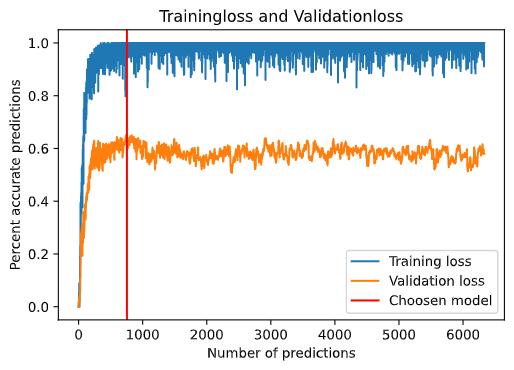
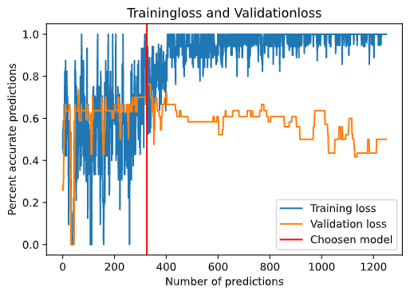

# Conversational Engine for Transportational Dialogues
This project is a bachleor's thesis exploring the possibility to extract named entities and topic classifications from dialogues between operators and drivers of vehicles. 
<br><br>
This project focuses on dialogues between drivers of cargoships and the traficoperators which controls the traffic flow in a harbour.

## Setup

1. Move into a directory where the root folder should be and use 
```
git clone git@gitlab.liu.se:albsi727/conversationalenginefortransportationalsystems.git
```
2. Install the required packages:
```
pip3 install -U setuptools wheel

pip3 install -r requirements.txt

python3 -m spacy download en_core_web_md
```
3. Start up the `create_data` notebook which are located in the directory `Datageneration` and run the cells to generate a datasets. 

4. In the root folder of the project you can choose to do NER or Topic classification within the notebooks `NER_classification` or `Topic_classification`. The implementations and models for these notebooks can be found in the `Models` directory.

## Results
During training of the models a manually transcribed dataset was used as 
the validation dataset, this loss can be seen in the below images as the orange 
values while the training values are marked in blue.

### Named Entity Recognition 
</img><br>
The choosen model from the above image achieved a precision of 66% on the transcribed test dataset. 

### Topic classification
</img><br>
The choosen model from the above image achieved a precision of 78.57% on the transcribed test dataset.

## Authors
Albin Sidås albinsidas@gmail.com <br>
Simon Sandberg simsa999@student.liu.se <br>
